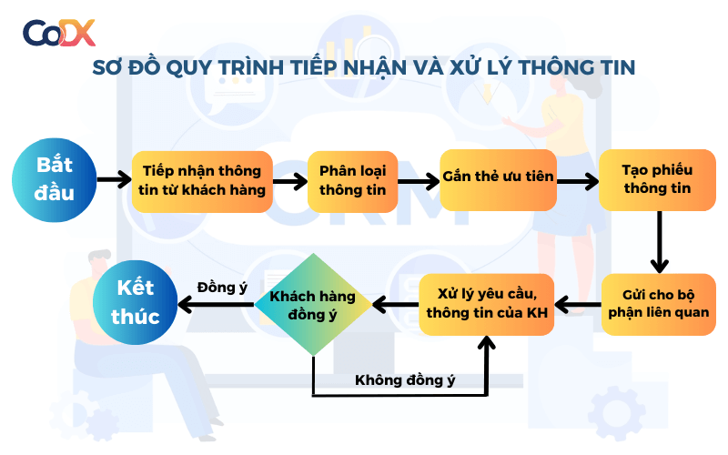

# QUY TRÌNH TIẾP NHẬN VÀ XỬ LÝ SỰ CỐ CÔNG NGHỆ

## 1. Mục đích áp dụng
### 1.1 Chi tiết các bước
Tài liệu chuẩn hóa các bước phản hồi yêu cầu kỹ thuật nội bộ của đơn vị.

## 2. Các bước triển khai
| STT | Bước thực hiện | Bộ phận xử lý | Thời hạn |
| :---: |  :--- | :--- | :--- |
| 01 | Tiếp nhận thông tin | Cán bộ trực | 15 phút |
| 02 | Phân loại và điều phối | Trưởng bộ phận | 30 phút |
| 03 | Phản hồi kết quả | Kỹ thuật viên | 24 giờ |

> **Quy định thời gian:** Phản hồi lần đầu trong vòng 30 phút kể từ khi nhận thông tin.
> **Lưu ý quan trọng:** Thời gian tối đa phản hồi là 24 giờ kể từ khi ghi nhận

